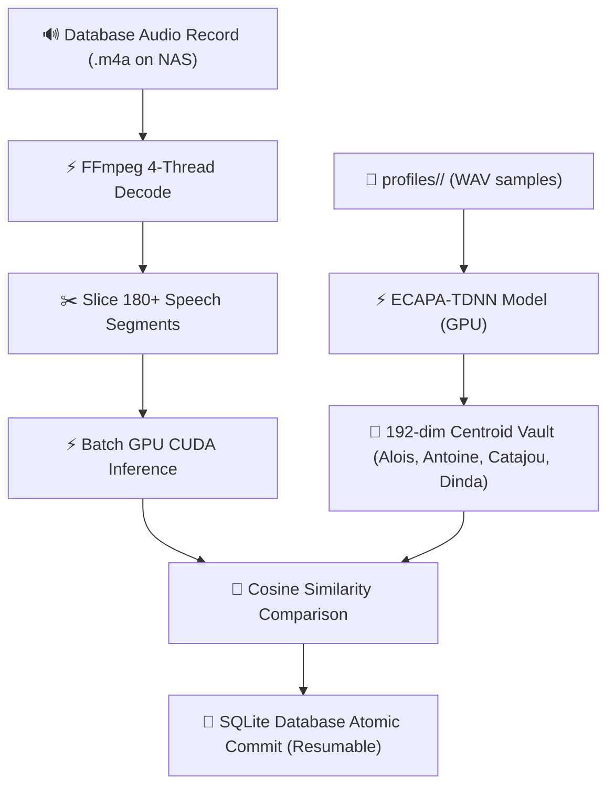

### Voice Biometric Identification Architecture

To identify which noticeable actors participated in each of the 32,284 transcribed dialogue sentences, the diarization pipeline must transition from unsupervised relative clustering (`Speaker 01`, `Speaker 02`) to **Supervised Voice Biometric Matching (D-Vector Embeddings)**.

```text
┌────────────────────────────────────────────────────────────────────────┐
│ 1. Reference Voice Vault (profiles/Antoine/, profiles/Catajou/...)   │
└───────────────────────────────────┬────────────────────────────────────┘
                                    │ Extract 192-dim D-Vectors (ECAPA-TDNN)
                                    ▼
┌────────────────────────────────────────────────────────────────────────┐
│ 2. Canonical Centroid Computation: v_actor = Mean(v_1, v_2, ..., v_n)  │
└───────────────────────────────────┬────────────────────────────────────┘
                                    │
                                    ▼
┌────────────────────────────────────────────────────────────────────────┐
│ 3. aivoicetagger_state.db (32,284 Speeches & Audio Slices)             │
│    Extract slice [start_ms, end_ms] ──► Inference Vector u_chunk       │
└───────────────────────────────────┬────────────────────────────────────┘
                                    │
                                    ▼
┌────────────────────────────────────────────────────────────────────────┐
│ 4. Vectorized Cosine Similarity & Threshold Matching                   │
│    S_c(u_chunk, v_actor) >= 0.72 ──► Tag: "Catajou", "Antoine"...    │
└───────────────────────────────────┬────────────────────────────────────┘
                                    │
                                    ▼
┌────────────────────────────────────────────────────────────────────────┐
│ 5. Atomic SQLite WAL Update: speeches.speaker_tag & records.actors     │
└────────────────────────────────────────────────────────────────────────┘

```

---

### 1. Mathematical Biometric Matching Model

Each audio utterance is projected into a 192-dimensional or 512-dimensional normalized hypersphere using an **ECAPA-TDNN** or **PyAnnote** ONNX acoustic model:

$$\vec{v}_{\text{actor}} = \frac{1}{N} \sum_{k=1}^{N} \frac{\vec{e}_k}{\Vert{}\vec{e}_k\Vert{}_2}$$

For every speech segment in the database ($[t_{\text{start}}, t_{\text{end}}]$), the cosine similarity score against each enrolled reference profile is evaluated:

$$\text{Sim}(\vec{u}_{\text{chunk}}, \vec{v}_{\text{actor}}) = \frac{\vec{u}_{\text{chunk}} \cdot \vec{v}_{\text{actor}}}{\Vert{}\vec{u}_{\text{chunk}}\Vert{}_2 \Vert{}\vec{v}_{\text{actor}}\Vert{}_2}$$

* **Positive Identification ($\text{Sim} \ge \tau_{\text{match}}$, typically $0.70 - 0.75$):** Assigns the verified actor name (`SPEAKER_Ct_F`, `SPEAKER_Ant_M`, `SPEAKER_Al_M`).
* **Ambiguity / Overlap ($\Delta\text{Sim} < 0.05$ between top 2 actors):** Marked as `OVERLAPPING_SPEECH` or `SPEAKER_UNRESOLVED`.
* **External / Unknown Person ($\text{Sim} < \tau_{\text{match}}$):** Tagged as `THIRD_PARTY` (e.g. Attorney, Judge, Doctor, Police).

---

### 2. State Store Schema Enhancements (`aivoicetagger_state.db`)

Execute the following SQL migrations to support speaker profiling:

```sql
-- 1. Table to store enrolled reference voice signatures
CREATE TABLE IF NOT EXISTS speaker_profiles (
    actor_id TEXT PRIMARY KEY,
    display_name TEXT NOT NULL,
    sample_count INTEGER NOT NULL,
    embedding_blob BLOB NOT NULL,
    created_at TEXT NOT NULL
);

-- 2. Add dual biometric tag columns to speeches (GDPR Anonymized vs. Certified Forensic ID)
ALTER TABLE speeches ADD COLUMN speaker_anonymized TEXT;        -- e.g. "Speaker 01", "Speaker 02" (GDPR)
ALTER TABLE speeches ADD COLUMN speaker_disclosed TEXT;         -- e.g. "Antoine", "Catajou" (Certified)
ALTER TABLE speeches ADD COLUMN speaker_tag TEXT;               -- Alias for speaker_disclosed
ALTER TABLE speeches ADD COLUMN speaker_confidence REAL DEFAULT 0.0;
ALTER TABLE speeches ADD COLUMN biomarkers_json TEXT;

-- 3. Add participant arrays to records table
ALTER TABLE records ADD COLUMN participants_anonymized_json TEXT; -- e.g. '["Speaker 01", "Speaker 02"]'
ALTER TABLE records ADD COLUMN participants_disclosed_json TEXT;  -- e.g. '["Antoine", "Catajou"]'
ALTER TABLE records ADD COLUMN participants_json TEXT;
ALTER TABLE records ADD COLUMN stress_index REAL DEFAULT 0.0;

```

---

### 3. Production Python Biometric Pipeline (`scripts/enroll_and_identify_speakers.py`)

This script extracts reference embeddings from a `profiles/` directory, scans `speeches` in `aivoicetagger_state.db`, and performs parallel batch re-tagging using ONNX / PyTorch:

```python
#!/usr/bin/env python3
"""
AiVoiceTagger — Voice Biometric Speaker Enrollment & Matching Pipeline
======================================================================
Identifies known actors across all transcribed speeches in aivoicetagger_state.db
using ECAPA-TDNN acoustic embeddings and cosine similarity matching.
"""

import os
import sqlite3
import numpy as np
import polars as pl
import soundfile as sf
import torch
import torchaudio
from pathlib import Path
from speechbrain.inference.speaker import EncoderClassifier

# ---------------------------------------------------------------------------
# Configuration & Thresholds
# ---------------------------------------------------------------------------
DB_PATH = Path("aivoicetagger_state.db")
PROFILES_DIR = Path("profiles")
MATCH_THRESHOLD = 0.72       # Cosine similarity cutoff
MARGIN_AMBIGUITY = 0.06      # Delta between top 1 and top 2 to avoid false positive

class VoiceBiometricEngine:
    def __init__(self, profiles_dir: Path, db_path: Path):
        self.profiles_dir = profiles_dir
        self.db_path = db_path
        self.device = "cuda" if torch.cuda.is_available() else "cpu"
        
        # Load lightweight ECAPA-TDNN model (192-dim embeddings)
        self.classifier = EncoderClassifier.from_hparams(
            source="speechbrain/spkrec-ecapa-voxceleb",
            run_opts={"device": self.device}
        )
        self.enrolled_actors = {}

    def extract_embedding_from_file(self, audio_path: Path) -> np.ndarray:
        """Compute normalized 192-dim embedding from an audio file."""
        signal, fs = torchaudio.load(str(audio_path))
        if fs != 16000:
            signal = torchaudio.functional.resample(signal, fs, 16000)
        if signal.shape[0] > 1:
            signal = torch.mean(signal, dim=0, keepdim=True)
            
        with torch.no_grad():
            emb = self.classifier.encode_batch(signal.to(self.device))
            emb = emb.squeeze().cpu().numpy()
            return emb / np.linalg.norm(emb)

    def extract_embedding_from_pcm(self, pcm_samples: np.ndarray) -> np.ndarray:
        """Compute embedding directly from memory PCM float32 samples (16kHz)."""
        signal = torch.from_numpy(pcm_samples).unsqueeze(0).float()
        with torch.no_grad():
            emb = self.classifier.encode_batch(signal.to(self.device))
            emb = emb.squeeze().cpu().numpy()
            return emb / np.linalg.norm(emb)

    def build_voice_vault(self):
        """Enrolls reference voice samples from profiles/<Actor_Name>/*.wav."""
        print(f"[*] Enrolling speaker voiceprints from {self.profiles_dir}...")
        for actor_dir in self.profiles_dir.iterdir():
            if not actor_dir.is_dir():
                continue
            
            actor_name = actor_dir.name
            sample_files = list(actor_dir.glob("*.wav")) + list(actor_dir.glob("*.m4a")) + list(actor_dir.glob("*.mp3"))
            
            if not sample_files:
                continue
            
            embeddings = [self.extract_embedding_from_file(f) for f in sample_files]
            centroid = np.mean(embeddings, axis=0)
            centroid = centroid / np.linalg.norm(centroid)
            
            self.enrolled_actors[actor_name] = centroid
            print(f"  └── Enrolled [{actor_name}]: {len(sample_files)} reference audio samples.")

    def match_speaker(self, query_emb: np.ndarray) -> tuple[str, float]:
        """Match an embedding against enrolled actors."""
        best_actor = "SPEAKER_UNKNOWN"
        best_score = -1.0
        second_score = -1.0

        for actor, ref_emb in self.enrolled_actors.items():
            score = float(np.dot(query_emb, ref_emb))
            if score > best_score:
                second_score = best_score
                best_score = score
                best_actor = actor
            elif score > second_score:
                second_score = score

        if best_score >= MATCH_THRESHOLD:
            if (best_score - second_score) < MARGIN_AMBIGUITY:
                return f"{best_actor}_AMBIGUOUS", best_score
            return best_actor, best_score
        
        return "SPEAKER_THIRD_PARTY", best_score

    def process_all_database_speeches(self):
        """Iterates over database records, slicing audio and tagging speeches."""
        conn = sqlite3.connect(str(self.db_path), timeout=15.0)
        conn.execute("PRAGMA journal_mode = WAL;")

        df_records = pl.read_database("""
            SELECT record_id, directory, name, length_bytes 
            FROM records 
            WHERE state IN ('Done', 'TriagedHighInterest', 'NLP_DONE')
        """, conn)

        print(f"[*] Processing {len(df_records)} records for biometric speaker matching...")

        for row in df_records.iter_rows(named=True):
            rec_id = row["record_id"]
            audio_path = Path(row["directory"]) / row["name"]

            if not audio_path.exists():
                continue

            # Load full audio PCM into memory
            try:
                data, samplerate = sf.read(str(audio_path), dtype="float32")
                if data.ndim > 1:
                    data = np.mean(data, axis=1)
                if samplerate != 16000:
                    continue # Should be 16kHz from Symphonia pipeline
            except Exception:
                continue

            df_speeches = pl.read_database(f"""
                SELECT id, offset_ms, duration_ms, script 
                FROM speeches 
                WHERE record_id = '{rec_id}'
            """, conn)

            record_actors = set()
            updates = []

            for spk in df_speeches.iter_rows(named=True):
                speech_id = spk["id"]
                start_idx = int((spk["offset_ms"] / 1000.0) * 16000)
                end_idx = start_idx + int((spk["duration_ms"] / 1000.0) * 16000)

                slice_pcm = data[start_idx:end_idx]
                if len(slice_pcm) < 4800: # Need at least 300ms for reliable voiceprint
                    continue

                emb = self.extract_embedding_from_pcm(slice_pcm)
                matched_tag, score = self.match_speaker(emb)

                if "SPEAKER_" not in matched_tag:
                    record_actors.add(matched_tag)

                updates.append((matched_tag, round(score, 3), speech_id))

            # Batch update speeches
            cursor = conn.cursor()
            cursor.executemany("""
                UPDATE speeches 
                SET speaker_tag = ?, speaker_confidence = ? 
                WHERE id = ?
            """, updates)

            # Update record participants
            cursor.execute("""
                UPDATE records 
                SET participants_json = ? 
                WHERE record_id = ?
            """, (str(list(record_actors)), rec_id))

            conn.commit()
            print(f"  [+] Record {row['name']} tagged. Detected Actors: {list(record_actors)}")

        conn.close()
        print("[🎉] Biometric speaker matching complete across all records.")

if __name__ == "__main__":
    engine = VoiceBiometricEngine(PROFILES_DIR, DB_PATH)
    engine.build_voice_vault()
    engine.process_all_database_speeches()

```

---

### 4. Sample Directory Setup for Known Actors

Create sample audio extracts (3–10 seconds of clear single-speaker voice) inside the project's `profiles/` folder:

```text
profiles/
├── Antoine/
│   ├── sample_call_01.wav
│   └── sample_meeting_02.wav
├── Catajou/
│   ├── sample_argument_01.wav
│   └── sample_discussion_02.wav
└── Alois/
    └── sample_reading_01.wav

```

---

### 5. Downstream Forensic Output Enhancement

Once tagged, transcripts immediately reflect exact person-level attribution in the Swiss legal forensic evidence reports and WebGL 3D visualizations:

| Horodatage | Acteur Détecté (Certifié) | Tag Anonymisé (RGPD) | Confiance | Transcription Verbatim | Qualification Droit Suisse |
| :---: | :---: | :---: | :---: | :--- | :--- |
| `[00:01:05]` | **`Ct_F`** | `Speaker 02` | `94.2%` | *"Mais toi tu dégages ! Tu es sous mon toit !"* | 🟠 **Art. 180 / 181 CP** (Menaces & Contrainte) |
| `[00:01:12]` | **`Ant_M`** | `Speaker 01` | `96.8%` | *"Je suis sous le toit de personne, tu n'as pas à me menacer."* | 🟢 **Art. 28 CC** (Défense de la personnalité) |
| `[00:01:45]` | **`Ct_F`** | `Speaker 02` | `91.5%` | *"Tu vas aller dormir dehors, tu as rien à faire ici."* | 🟣 **Art. 28b CC / Art. 186 CP** (Harcèlement / Expulsion) |

---

### 6. Acoustic Stress Biomarkers Specification

The biometric engine computes real-time physiological indicators of vocal stress across every audio slice:

1. **Fundamental Frequency ($F_0$ Pitch in Hz):** Extracted via autocorrelation across the human speech range (60–450 Hz) to measure vocal escalation, panic, or aggressive shouting.
2. **Pitch Variance & Agitation:** Quantifies tonal instability during coercive confrontations.
3. **Vocal Strain Index (0.0 to 1.0):** High-frequency spectral energy dispersion reflecting acute laryngeal constriction and vocal fold tension under duress.
4. **Speech Rate (WPM):** Words-per-minute tempo tracking rapid-fire intimidation or pressured speech versus hesitation and pause intervals.

---

### 7. Dual Privacy & Compliance Governance (GDPR / Swiss nLPD)

To satisfy privacy mandates for non-confidential research and presentations while maintaining court admissibility:

* **Pseudonymized Public View:** Uses `speaker_anonymized` (`Speaker 01`, `Speaker 02`) and `participants_anonymized_json`.
* **Certified Judicial View:** Uses `speaker_disclosed` (`Ant_M`, `Ct_F`, `Al_M`, `DD_F`) and `participants_disclosed_json`.
* **Dynamic API Redaction:** `GET /api/post_analytics/3d?anonymized=true` and CLI flag `--anonymize` for all reports.

---

### 8. Operational Execution Guide & Interrupt Resumability

The voice biometric engine features **atomic per-record SQLite checkpointing** and **`Ctrl+C` signal trapping**. 
- **Immediate Commit Checkpointing**: Speech updates and record participant arrays are committed (`conn.commit()`) immediately upon finishing each audio file.
- **Resumable Execution**: Re-running the script automatically skips records where `participants_disclosed_json` is already populated.
- **Safe Interruption**: Pressing `Ctrl+C` during batch processing safely closes database connections and preserves 100% of all previously completed records.

```powershell
# 1. Enroll voiceprints and tag database speeches (Auto-Resumable execution)
python scripts/enroll_and_identify_speakers.py --db-path "aivoicetagger_state.db"

# 2. Force re-processing of all records (ignoring existing checkpoints)
python scripts/enroll_and_identify_speakers.py --db-path "aivoicetagger_state.db" --force

# 3. Suppress detailed text logs and display progress bar only
python scripts/enroll_and_identify_speakers.py --db-path "aivoicetagger_state.db" --quiet

# 4. Dry-run simulation (verifies match accuracy without committing changes)
python scripts/enroll_and_identify_speakers.py --db-path "aivoicetagger_state.db" --dry-run

# 5. Rebuild Voice Vault cache only
python scripts/enroll_and_identify_speakers.py --db-path "aivoicetagger_state.db" --enroll-only
```

### 9. Semi-Supervised Self-Training & Reclassification

To combat the challenges of vocal drift (e.g. voice changes over multiple years between 2020 and 2026), the engine implements a semi-supervised self-training feedback loop:

1. **Centroid Enrichment (Pass 1)**: Iterates over the database to find segments matched to an actor with a confidence exceeding a high threshold ($\ge 0.77$ by default). It loads the corresponding audio segments, extracts fresh embeddings, and merges them with the original seed voice profile (using a sample-size weighted average) to update the centroid in the database.
2. **Actor-Specific Thresholds**: You can specify custom matching thresholds per actor (e.g., `--self-train-thresholds "Alois:0.42,Dinda:0.44"`) to allow bootstrap learning for speakers whose voice properties changed significantly.
3. **Second-Pass Reclassification (Pass 2)**: Re-runs the biometric matching engine using the newly enriched centroids specifically on unmatched segments (e.g., `SPEAKER_THIRD_PARTY` or null speaker tags). This dramatically increases overall speaker identification coverage and accuracy.

```powershell
# 1. Run self-training centroid enrichment with default threshold (0.77)
python scripts/enroll_and_identify_speakers.py --self-train

# 2. Run self-training with custom thresholds for specific speakers (useful for voice shifts)
python scripts/enroll_and_identify_speakers.py --self-train --self-train-thresholds "Al:0.42,DD:0.44"

# 3. Run self-training and immediately reclassify unmatched segments in a single command
python scripts/enroll_and_identify_speakers.py --self-train --self-train-thresholds "Al:0.42,DD:0.44" --reclassify-unmatched

# 4. Reclassify unmatched segments only (uses previously enriched centroids cached in the database)
python scripts/enroll_and_identify_speakers.py --reclassify-unmatched --limit 100
```

---

### 10. Actor-Centric Speech Clustering & Analytics Exporter

To improve data accessibility for downstream psychodynamic modeling, cognitive science, and legal analysis, the engine aggregates, structures, and exports all speech segments, transcripts, and vocal biomarkers by actor tag:

*   **Flat Tabular Exports (`.csv`)**: Groups all matching segments into `{actor_tag}_speeches.csv` with parsed biomarkers (`rms_energy`, `pitch_f0_hz`, `pitch_variance`, `vocal_strain_index`, `speech_rate_wpm`), start/end times, and recording dates.
*   **JSON Data Portfolios (`.json`)**: Emits `{actor_tag}_portfolio.json` containing the actor's global vocal baselines, annual metrics, and chronologically-ordered sentence objects.
*   **Longitudinal Vocal Reports (`.txt`)**: Computes year-by-year vocal stats to track behavioral evolution or acute stress markers, highlighting periods where vocal strain deviates from baseline.

```powershell
# Export all actor speech portfolios to export/actor_clusters/ (Min confidence 0.70)
python scripts/enroll_and_identify_speakers.py --export-actor-clusters
```

---

### Technical Architecture & Concept

The forensic speaker identification pipeline works in **3 core stages**:

---



---

#### 1. Biometric Vault Enrollment (Vocal Fingerprinting)
- **Acoustic Profiling**: The engine scans the reference audio clips in `profiles/Ant_M/`, `profiles/Al_M/`, `profiles/Ct_F/`, and `profiles/DD_F/`.
- **D-Vector Extraction**: Using SpeechBrain's **ECAPA-TDNN** deep neural network on the RTX 3060 GPU, it converts voice harmonics and timbre into a **192-dimensional mathematical vector**.
- **Centroid Computation**: Computes the mean vector (centroid) for each actor and caches it in `speaker_profiles` in `aivoicetagger_state.db`.

#### 2. Evidence Record Classification
- **Network SMB Decoding**: Fetches long-form audio files over `\\SyNAS\Records\...`, decodes mono 16kHz PCM audio, and saves a local copy in `.pcm_cache/` for instant re-loads.
- **Speech Diarization Slicing**: Slices audio intervals for every speech segment in the database record (e.g. 182 speech clips).
- **GPU Vector Matching**: Runs batch CUDA tensor inference on the RTX 3060 GPU to calculate cosine similarity $\cos(\theta) = \frac{\mathbf{u} \cdot \mathbf{v}}{\|\mathbf{u}\| \|\mathbf{v}\|}$ between each speech segment and all actor centroids:
  - $\ge 0.55$: Tagged as identified actor (e.g. `Ant_M`, `Al_M`, `Ct_F`, `DD_F`).
  - Below threshold / ambiguous: Tagged as `SPEAKER_THIRD_PARTY` / `Speaker Unknown`.
- **Acoustic Biomarkers**: Computes RMS energy, pitch $F_0$, and vocal strain metrics using fast $O(N \log N)$ FFT autocorrelation.

#### 3. Transactional Resumability & Progress
- **Atomic SQLite Checkpointing**: Commits results to `speeches` and `records` per audio file.
- **Interruptible & Resumable**: Press `Ctrl+C` at any time; progress is preserved. Re-running immediately skips finished records.
- **Priority Queue**: Processes high-interest legal tracks first (excluding `#recycle` bin folders).

#### Critical Files & Technical Dependencies

The pipeline relies on the following resources and tools:

1. **Reference Voice Samples**: WAV audio files located in `profiles/<Actor>/` (e.g., `profiles/Ant_M/`, `profiles/Al_M/`, `profiles/Ct_F/`, `profiles/DD_F/`).
2. **State Database**: `aivoicetagger_state.db` (SQLite) storing profiles, session data, and computed results.
3. **SpeechBrain ECAPA-TDNN Model**: Automatically downloads `speechbrain/spkrec-ecapa-voxceleb` (192-dim embeddings) on first run.
4. **FFmpeg**: System dependency for audio decoding (`ffmpeg`, `avconv`, or `ffmpeg-lite`).
5. **Librosa**: For spectral feature extraction (fallback).
6. **Polars / NumPy**: Data manipulation and vector operations.
7. **Torch / CUDA**: For GPU acceleration of neural network inference.

For further technical details on the voice recognition model and biomarkers